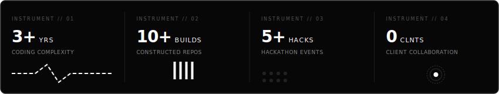
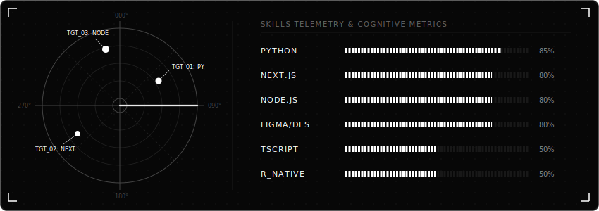

# NAMAN MITTAL // CREATIVE DEVELOPER

<!-- Premium Animated Header SVG -->
<p align="center">
  
</p>

---

### // CORE OBSERVATORY METRICS
<p align="center">
  
</p>

---

### // RADAR TELEMETRY LEVEL
<p align="center">
  
</p>

---

### // SYSTEM SPECIFICATIONS

```text
  [HOST MACHINE]  : NAMAN-OBSERVATORY-NODE
  [OPERATING SYS] : ARCH-LINUX v2026.06
  [RUNTIME ENV]   : NODE.JS v22.0.0, PYTHON v3.12.3
  [SHELL TYPE]    : ZSH - DYNAMIC CORE ACTIVE
```

| Component | Instruments & Technologies |
| :--- | :--- |
| **Languages** | Python, TypeScript, JavaScript, HTML5, CSS3, SQL |
| **Frameworks** | Next.js, React, Node.js, React Native, Express |
| **Environments** | Git, Docker, Amazon Web Services (AWS), Figma, Postman |
| **Specialties** | Creative Development, High-fidelity UI/UX, Performance Opt, Lenis Smooth-scroll |

---

### // ESTABLISHING COMMUNICATIONS

```text
  >>> ATTEMPTING HANDSHAKE...
  >>> CONNECTION: SECURE (TLS v1.3)
```

* **Email Terminal**: [coolguynova0302@gmail.com](mailto:coolguynova0302@gmail.com)
* **LinkedIn Uplink**: [naman48708](https://www.linkedin.com/in/naman48708)
* **Digital Archives**: [coolguynova.github.io](https://coolguynova.github.io) _(Launch your Portfolio Website)_

---

<p align="right">
  <i>// System Status: NOMINAL // Delhi, India // 2026.</i>
</p>
