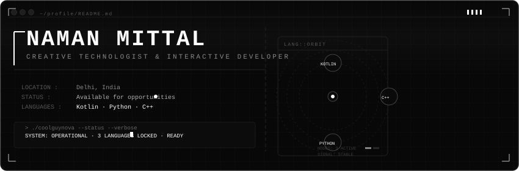

<br>

> Creative technologist based in Delhi, India. I write **Kotlin**, **Python**, and **C++** — building things that sit at the intersection of clean engineering and interactive experiences.

---

### now

- 🔭 Working on Android apps with **Kotlin + Ktor**
- 🌱 Diving deeper into **systems programming with C++**
- ⚡ Currently building a few things I'll ship soon
- 🎯 2026 focus: ship more, overthink less

---

### stack

```
Kotlin   ▰▰▰▰▰▰▰▰▰▰  Android, Ktor, Coroutines
Python   ▰▰▰▰▰▰▰▰▰▰  FastAPI, Data, Automation
C++      ▰▰▰▰▰▰▰▰▰▰  Algorithms, Systems, Game Dev
```

---

### github

<p align="center">
  
</p>

<p align="center">
  
  
  
</p>

---

### projects

| Project | Stack | Status |
|---------|-------|--------|
| **Alpha** | Kotlin · Ktor · Android | building |
| **Beta** | Python · FastAPI · ML | planning |
| **Gamma** | C++ · Algorithms | exploring |

---

### contact

<table>
  <tr>
    <td align="center">
      <a href="https://linkedin.com/in/naman--mittal">
        
      </a>
    </td>
    <td align="center">
      <a href="mailto:namanmittal501@gmail.com">
        
      </a>
    </td>
    <td align="center">
      <a href="https://github.com/coolguynova">
        
      </a>
    </td>
  </tr>
</table>

---

<br>
<div align="center">
  <sub><code>thanks for stopping by :)</code></sub>
</div>
